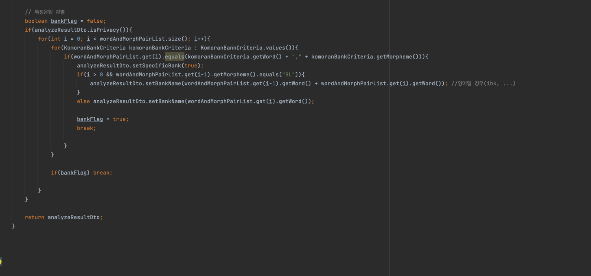

# SH Pay

## 개요
> 금융결제원 OpenAPI를 이용해 오픈뱅킹 서비스를 제공하여 사용자 정보 등을 제공하고 간편한 금융 서비스를 제공합니다. 사용자의 계좌 정보를 확인할 수 있으며 출금 및 입금을 간편하게 이용할 수 있습니다.<br><br>
> 더불어 ChatGPT 기반 챗봇을 통해 금융지식을 얻을 수 있으며 편리하게 사용자의 계좌 내역을 조회할 수 있습니다.

### 역할 및 기간
- **개인 프로젝트**
- **기간 : 2024.01.15 ~**

<br>
<hr>

## 시작 가이드
```html
1. Git clone this repository
2. Write application-real.yml
3. You need 금융결제원 OpenAPI account
    3-1. Sign up 금융결제원 사이트
    3-2. Add below list at application-real.yml file
          bank-tran-id: -
          client-id: -
          client-secret: -
          redirect-uri: -
4. you need OpenAI account
    4-1. Sign up OpenAI website and get secret key
    4-2. Add below list at application-real.yml file
        secret: -
        model: -
        user: -
4. Run this project!
```
- [금융결제원 OpenAPI 개발자 사이트](https://developers.kftc.or.kr/dev)
- [Check out application-real.yml file](https://github.com/OOOIOOOIO/SHPay/wiki/application%E2%80%90real.md)

<br>
<hr>

## SKills
- **Java 17**
- **Gradle**
- **Spring Boot 3.2.1**
- **Spring Data JPA**
- **Querydsl 5.0**
- **MySQL 8.1.0**
- **Redis**
- **Session(Spring Redis Session)**
- **AWS EC2, RDS**
- **Docker**
- **금융결제원 OpenAPI**
- **OpenAI ChatGPT API**
- **Domain Driven Design**
- **Layered Architecture**
- **RESTful API**

<br>
<hr>

## Architecture


## ERD



<br>
<hr>

## API 목록
[API 확인하러 가기](https://github.com/OOOIOOOIO/SHPay/tree/main/src/main/java/http)

<br>
<hr>

## 역할 및 기능
- **도메인 개발**
  - **User**
  - **OpenBanking**
  - **Account**

- **금융결제원 OpenAPI를 활용한 금융서비스 개발**
  - **사용자 AuthCode 발급**
  - **사용자 토큰 발급(3-legged)**
    - **사용자 정보 조회용**
  - **사용자 토큰 발급(2-legged)**
    - **입-출금이체용**
  - **사용자 토큰 갱신**
  - **사용자 정보 조회**
  - **사용자 계좌 리스트 조회**
  - **사용자 잔액 조회**
  - **거래내역 조회**
  - **출금이체**
  - **입금이체**

- **OpenAI를 이용한 Custom Chatbot 서비스 개발**
  - Q&A 기능


<br>
<hr>

## Screenshot
[Screenshot 보러가기](https://github.com/OOOIOOOIO/SHPay/wiki/Screenshot.md)

<br>
<hr>

## 주요 Code

### Redis를 이용한 bank_tran_id 저장


- **문제상황**
  - **bank_tran_id는 은행 거래 고유번호로서 같은 번호일 경우 00시까지 중복을 허용하지 않습니다. 때문에 API 호출 시 고유번호가 유일한지 검사해야 했기에, 매번 DB IO를 타게 될 경우 성능 저하 이슈가 발생할 수 있었습니다.**
- **해결방법 및 실행**
  - **이를 해결하고자 Redis의 캐싱 사용해 빠르게 읽어와 고유번호가 유일한지 확인하였습니다. 또한 00시까지 expire time을 설정하여 초기화를 진행하였습니다.**
- **성과**
  - **이를 통해 불필요한 DB IO를 줄일 수 있는 방법에 대해 고민할 수 있었고 캐싱 기능을 조금 더 이해할 수 있었습니다.**

<br>

### 계좌정보 확인 로직


- **문제상황**
  - **계좌를 DB에 저장하고 DB에서 계좌 조회시 오픈뱅킹 API를 호출하여 계좌잔액을 조회해야 했습니다. 잔액 조회시 해당 은행에 요청해야 하는데, 이때 요청이 길어질 경우 이후 요청에 차질이 생길 것 같았습니다.**
- **해결방법 및 실행**
  - **비동기 방식을 이용하여 이전 작업의 완료를 기다리지 않고 동시에 실행하였습니다. Java8의 CompletableFuture 클래스를 활용하였습니다.**
    - supplyAsync() : 비동기 요청을 실행하였으며 Dto를 반환값으로 받고 있습니다.
    - orTimeout() : 계좌조회시 10초 정도 걸릴 경우 문제가 발생한 것으로 간주하고 제한시간을 두었습니다. TimeOutException이 발생하기 때문에 RestControllerAdvice로 예외처리 해주었습니다.
    - handle() : 비동기 요청시 예외가 발생할 경우 CustomException을 던져 예외처리를 진행하였습니다.
- **성과**
  - **비동기 처리를 통해 동시성에 대한 개념을 이해했고, 로직을 개발하며 어느 부분에서 문제가 발생할 수 있을지에 대해 생각해보고 이를 해결하기 위해 고민하는 능력을 길렀습니다.**


<br>

### 일반 금융상식 및 개인 정보 조회 질문 구분 로직
- **문제상황**
  - **ChatGPT를 사용하여 일반 금융상식에 대해선 답변이 가능하나, 사용자 개인정보를 질문할 경우 분기처리 필요**
- **해결방법 및 실행**
  - 
  
- **성과**
  - 
  


<br>
<hr>


[//]: # (## 회고)

[//]: # ()
[//]: # ()
[//]: # (### 성과 및 배운점)

[//]: # ()
[//]: # ()
[//]: # (### 아쉬웠던 점)


[//]: # (# 회원가입, 로그인)

[//]: # (- Session 사용)

[//]: # (  - redis sesison 사용)

[//]: # (  - custom resolver를 통해 session 정보 파싱)

[//]: # ()
[//]: # (# 오픈뱅킹)

[//]: # (- DB에 정보 저장)

[//]: # (  - 계좌 정보)

[//]: # (  - 유저 정보)

[//]: # (- ApiClient 클래스를 만들어 모듈화)

[//]: # (  - resttemplate으로 외부 api와 통신)

